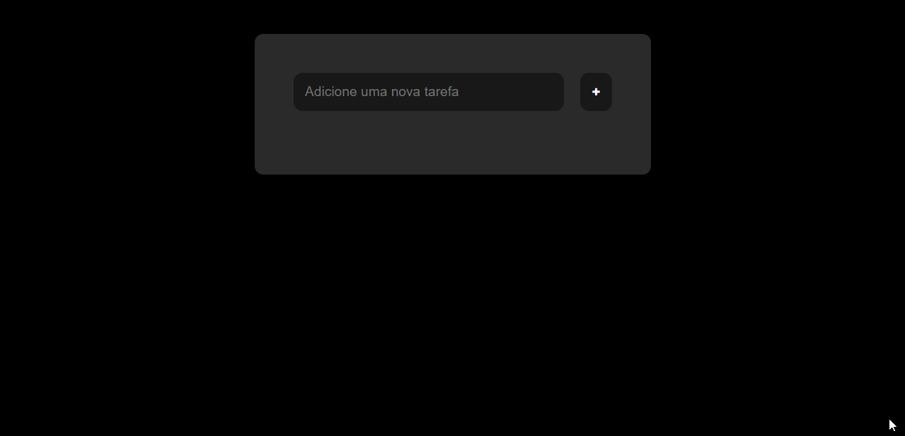

<h1 align="center">Lista de Tarefas com JavaScript</h1>

<h1 align="center">
  
</h1>

Lista de tarefas com HTML, CSS e Javascript

 

 ## 🚀 Tecnologias

Esse projeto foi desenvolvido com as seguintes tecnologias:

- [JavaScript](https://www.w3schools.com/w3js/)

- [HTML](https://www.w3schools.com/html/)

- [CSS](https://www.w3schools.com/css/)

 Para saber de outros ícones disponíveis, pode ser consultado aqui:
- [Font Awesome](https://www.w3schools.com/icons/fontawesome_icons_webapp.asp)

#### **Utilitários**

- **Respositorio  de [douglash93](https://github.com/douglash93/lista-de-tarefas/)**
- **Site para saber KeyCode das teclas [KeyCode](https://keycode.info/)**
- **Os ícones utilizados estão disponíveis aqui: [Font Awesome](https://cdnjs.cloudflare.com/ajax/libs/font-awesome/4.7.0/css/font-awesome.min.css)**
- **Canal do Youtube e Playlist: [Douglas Horstmann](https://www.youtube.com/playlist?list=PLEuLN871skK7VRR-MVvkTC8eIlKL62Z0Q)**
- **Icone Do Js no Readme: [Repositorio devicons/devicon](https://github.com/devicons/devicon/tree/master/icons)**
- **Editor: [Visual Studio Code](https://code.visualstudio.com/)**
- **Markdown: [Markdown Guide](https://www.markdownguide.org/basic-syntax/)**
- **Emoji Markdown: [Emoji Cheat Sheet](https://github.com/ikatyang/emoji-cheat-sheet)**
